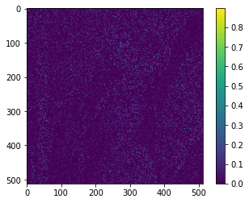
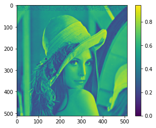

# compressed_sensing_python
simple to follow implementation of IHT (iterative hard thresholding) compresive sensing in python

below is an example how 5% samples of an image:

can be used to reconstruct the whole image:

